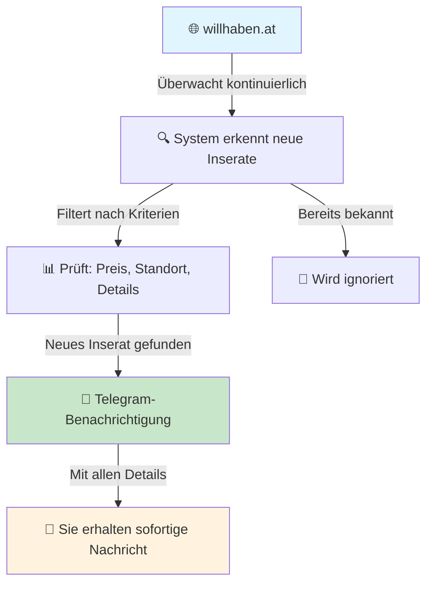
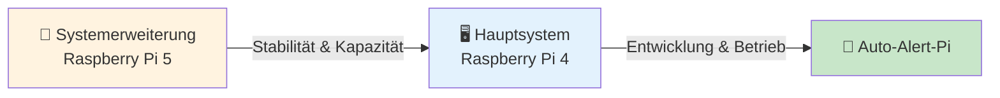

# Auto-Alert-Pi – Ihr persönliches Fahrzeuginserat-Erkennungssystem


> *"Falsche Lippen sind dem HERRN ein Gräuel; die aber treu handeln, gefallen ihm." (Sprüche 12,22)*

## 📂 Schnellzugriff

- 🏠 **Projektübersicht:** [README.md](README.md)
- 🧩 **Systemarchitektur:** [overview/system_structure.md](overview/system_structure.md)
- 📈 **Fortschritt & Updates:** [progress/updates.md](progress/updates.md)
- 🕓 **Projektzeitplan:** [usage/project_timeline.md](usage/project_timeline.md)
- 📞 **Support & Kontakt:** [Support & Wartung](#-support--wartung)

---

## 🚗 Was ist Auto-Alert-Pi?

Ein intelligentes System, das **automatisch** neue Fahrzeuginserate auf willhaben.at überwacht und Sie **sofort** per Telegram benachrichtigt, wenn interessante Angebote erscheinen.

### 🎯 Das Problem, das wir lösen

| **Vorher** | **Mit Auto-Alert-Pi** |
|------------|----------------------|
| ❌ Manuell ständig willhaben.at prüfen | ✅ Automatische 24/7-Überwachung |
| ❌ Wichtige Angebote verpassen | ✅ Sofortige Benachrichtigung (3-4 Sekunden) |
| ❌ "Versteckte" Inserate übersehen | ✅ Vollständige Erfassung aller Inserate |
| ❌ Zeitaufwändige Suche | ✅ Intelligente Filterung nach Ihren Kriterien |

## 🛡️ Qualität & Zuverlässigkeit

### 🔍 Warum können Sie uns vertrauen?
Wir entwickeln Ihr System nach höchsten Qualitätsstandards und mit vollständiger Transparenz. Jeder Schritt wird dokumentiert und kann von Ihnen nachvollzogen werden.

#### 📊 Unsere Qualitätsstandards
- **Gründliche Tests:** Jeder Teil des Systems wird einzeln getestet
- **Transparente Dokumentation:** Alle Arbeitsschritte sind nachvollziehbar
- **Regelmäßige Überprüfungen:** Das System wird kontinuierlich überwacht
- **Ehrliche Kommunikation:** Wir berichten ehrlich über Fortschritt und Herausforderungen

#### 🔒 Datensicherheit
- **Lokale Speicherung:** Alle Daten bleiben auf Ihrem System
- **Keine externen Server:** Ihre Daten verlassen nie Ihr Gerät
- **Vollständige Kontrolle:** Sie haben die volle Kontrolle über Ihr System

🔍 **Bedeutung:** Diese Standards stellen sicher, dass Sie ein zuverlässiges, sicheres und professionelles System erhalten.

## 🔄 Wie funktioniert das System?



### 📋 Schritt-für-Schritt Ablauf

| **Schritt** | **Was passiert** | **Dauer** |
|-------------|------------------|-----------|
| 1️⃣ | System überwacht willhaben.at | Kontinuierlich |
| 2️⃣ | Erkennt neue Inserate | 3-4 Sekunden |
| 3️⃣ | Prüft Preis und Details | 1-2 Sekunden |
| 4️⃣ | Sendet Telegram-Nachricht | Sofort |
| 5️⃣ | Speichert Inserat lokal | Automatisch |

## 💰 Kosten & Investition

### 💡 Was kostet das System?

| **Kostenart** | **Betrag** | **Wann** |
|---------------|------------|----------|
| **Entwicklung** | Nach Fertigstellung | Nach Abnahme |
| **Systemerweiterung** | 450-500€ | Einmalig |
| **Laufende Kosten** | Keine | - |

> **💡 Hinweis:** Die Systemerweiterung ist **notwendig** für die Projektrealisierung und wird einmalig angeschafft.

### 🔧 Hardware-Übersicht



## 📊 Aktueller Projektfortschritt

### ✅ Was bereits fertig ist

- [x] **Projektstruktur** - Professionelle Grundlage geschaffen
- [x] **Systemarchitektur** - Planung und Dokumentation abgeschlossen
- [x] **Code-Module** - Grundstruktur für alle Funktionen erstellt
- [x] **Datenbank-Design** - Speicherung aller Inserate vorbereitet
- [x] **API-Analyse** - willhaben.at Struktur analysiert

### 🔄 Was aktuell passiert

- [ ] **Testmodule** - Alle Systemkomponenten werden getestet
- [ ] **API-Integration** - Verbindung zu willhaben.at wird hergestellt
- [ ] **Telegram-Bot** - Benachrichtigungssystem wird konfiguriert
- [ ] **Erste Tests** - System wird mit echten Daten getestet

### 📅 Was als nächstes kommt

| **Zeitraum** | **Was passiert** | **Ihr Nutzen** |
|--------------|------------------|----------------|
| **Diese Woche** | Erste Benachrichtigungen | Sie sehen das System in Aktion |
| **Nächste Woche** | 24h-Stabilitätstest | System läuft zuverlässig |
| **Projektende** | Vollständige Übergabe | Sie haben Ihr System |

## 🎯 Ihr Nutzen im Überblick

### ⚡ Sofort nach Abnahme

- **Automatische Überwachung** - System läuft 24/7 ohne Ihre Anwesenheit
- **Sofortige Benachrichtigungen** - Innerhalb von 3-4 Sekunden
- **Vollständige Erfassung** - Kein Inserat wird übersehen
- **Intelligente Filterung** - Nur relevante Angebote

### 📈 Langfristig

- **Professionell entwickelt** - Vollständig getestet und dokumentiert
- **Erweiterbar** - Kann an Ihre Bedürfnisse angepasst werden
- **Transparente Kosten** - Keine versteckten Gebühren
- **Vollständige Dokumentation** - Sie verstehen, wie alles funktioniert

## 📱 Beispiel einer Benachrichtigung

```
🚗 Neues Fahrzeug gefunden!

BMW 3er 320d
💰 € 25.000

Details:
• 📅 2019
• 🏃 80.000 km
• ⛽ Diesel
• 🔧 Automatik
• 💪 150 PS
• 🎨 Schwarz

📍 Standort: Wien
🔗 Zum Inserat

⏰ Gefunden: 07.10.2025 15:30:45
```

## 📞 Support & Wartung

### 🔧 Was Sie erhalten

- **Vollständige Dokumentation** - Alle Funktionen erklärt
- **Bedienungsanleitung** - Schritt-für-Schritt Anweisungen
- **Technischer Support** - Bei Fragen immer erreichbar
- **Regelmäßige Updates** - System wird kontinuierlich verbessert

### 📋 Dokumentation verfügbar

- 📊 **Fortschrittslog** - Tägliche Updates zum Projektstand
- 📅 **Zeitplan** - Wann was passiert
- 💰 **Kostenaufstellung** - Transparente Kostenübersicht
- 🔧 **Wartungshinweise** - Wie das System gepflegt wird

## 🎯 Warum Auto-Alert-Pi?

### ✅ Ihre Vorteile

- **Zeitersparnis** - Keine manuelle Suche mehr nötig
- **Vollständigkeit** - Kein interessantes Angebot wird verpasst
- **Geschwindigkeit** - 3-4 Sekunden Reaktionszeit
- **Zuverlässigkeit** - 24/7-Betrieb ohne Unterbrechungen
- **Transparenz** - Ehrliche Kommunikation über alle Aspekte

### 🛡️ Qualitätssicherung

- **Gründliche Tests** - Jede Funktion wird validiert
- **24h-Stabilitätstest** - System läuft ohne Probleme
- **Vollständige Dokumentation** - Alles ist nachvollziehbar
- **Professionelle Entwicklung** - Nach bewährten Standards

---

## 📋 Schnellübersicht

| **Frage** | **Antwort** |
|-----------|-------------|
| **Was macht das System?** | Überwacht willhaben.at automatisch und benachrichtigt Sie |
| **Wie schnell?** | 3-4 Sekunden nach Erscheinen eines neuen Inserats |
| **Was kostet es?** | Entwicklung nach Fertigstellung + 450-500€ Hardware |
| **Wann ist es fertig?** | In 1-2 Wochen (realistische Planung) |
| **Wer entwickelt es?** | Andreas Eirich (transparente Zeiterfassung) |

---

**Letzte Aktualisierung:** 2025-10-07 17:29:24 (Europe/Berlin)  
**Entwickler:** Andreas Eirich  
**Status:** In Entwicklung - Testmodule werden validiert