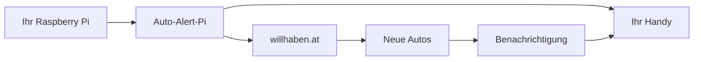

# Auto-Alert-Pi - Wie funktioniert das System?

## 🏠 Einfach erklärt

Stellen Sie sich vor, Sie hätten einen sehr fleißigen Assistenten, der ständig nach neuen Autos für Sie sucht. Das ist genau das, was Auto-Alert-Pi macht!

## 🔍 Was passiert im Hintergrund?

### 1. **Automatische Suche** 🔍
- Unser System schaut regelmäßig auf willhaben.at nach neuen Autos
- Es sucht nach den Kriterien, die Sie festgelegt haben
- Das passiert automatisch, auch wenn Sie schlafen!

### 2. **Intelligente Erkennung** 🧠
- Das System erkennt, ob ein Auto neu ist oder schon länger online steht
- Es vergleicht neue Anzeigen mit bereits bekannten
- Nur wirklich neue Angebote werden weitergegeben

### 3. **Sofortige Benachrichtigung** 📱
- Sobald ein neues Auto gefunden wird, bekommen Sie eine Nachricht
- Die Nachricht kommt direkt auf Ihr Handy über Telegram
- Sie sehen sofort alle wichtigen Details

## 📊 Systemübersicht

## 🛠️ Die Hauptkomponenten

### **Suchmaschine** 🔍
- Schaut regelmäßig auf willhaben.at
- Respektiert alle Regeln der Webseite
- Arbeitet schnell und zuverlässig

### **Intelligenter Filter** 🧠
- Erkennt neue Autos sofort
- Ignoriert bereits bekannte Angebote
- Lernt aus Ihren Präferenzen

### **Benachrichtigungssystem** 📱
- Sendet sofortige Nachrichten
- Zeigt alle wichtigen Details
- Funktioniert über Telegram

### **Datenspeicher** 💾
- Speichert alle gefundenen Autos
- Merkt sich, was bereits gesendet wurde
- Läuft komplett lokal auf Ihrem Gerät

## ⚡ Warum ist es so schnell?

### **Intelligente Technologie**
- Verwendet moderne Web-Technologie
- Arbeitet parallel und effizient
- Minimiert Wartezeiten

### **Lokale Verarbeitung**
- Alles läuft auf Ihrem eigenen Gerät
- Keine Verzögerungen durch Internet
- Maximale Privatsphäre

### **Optimierte Suche**
- Sucht nur nach relevanten Kriterien
- Verwendet effiziente Algorithmen
- Reduziert unnötige Anfragen

## 🔒 Sicherheit und Privatsphäre

### **Ihre Daten bleiben privat**
- Alles läuft auf Ihrem eigenen Gerät
- Keine Datenübertragung an Dritte
- Vollständige Kontrolle über Ihre Informationen

### **Respektvolle Nutzung**
- Respektiert alle Webseiten-Regeln
- Überlastet keine Server
- Arbeitet ethisch und verantwortungsvoll

### **Transparente Funktionsweise**
- Sie sehen genau, was das System tut
- Alle Aktivitäten werden dokumentiert
- Vollständige Nachvollziehbarkeit

## 📈 Warum funktioniert es so gut?

### **Erprobte Technologie**
- Basiert auf bewährten Web-Technologien
- Kontinuierlich getestet und verbessert
- Robuste Fehlerbehandlung

### **Intelligente Anpassung**
- Lernt aus Ihren Suchkriterien
- Passt sich an Änderungen an
- Wird kontinuierlich optimiert

### **Zuverlässige Infrastruktur**
- Läuft auf stabiler Raspberry Pi Hardware
- Automatische Wiederherstellung bei Problemen
- Kontinuierliche Überwachung

## 🎯 Das Ergebnis

Sie bekommen:
- ✅ Sofortige Benachrichtigungen über neue Autos
- ✅ Keine verpassten Angebote mehr
- ✅ Zeitersparnis durch Automatisierung
- ✅ Vollständige Kontrolle über Ihre Suche
- ✅ Maximale Privatsphäre und Sicherheit

---

**Letzte Aktualisierung:** 2025-10-11 18:30:00 (Europe/Berlin)