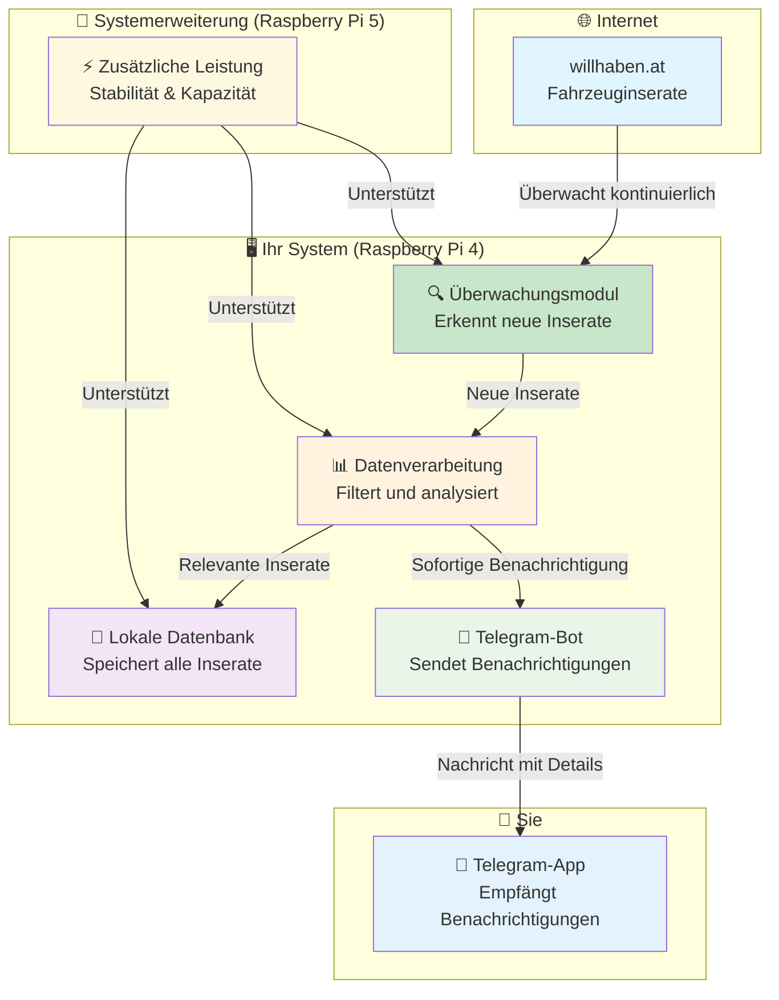
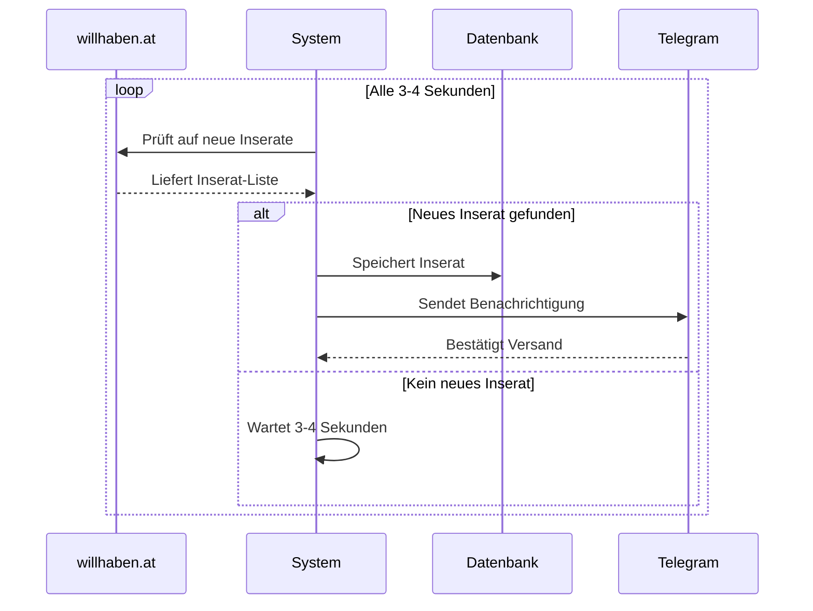
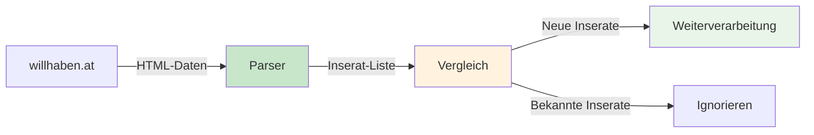
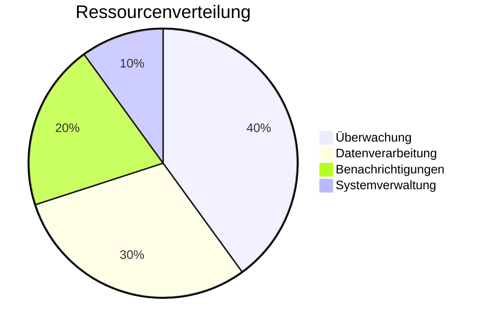

# Auto-Alert-Pi - Systemaufbau im Detail

> *"Falsche Lippen sind dem HERRN ein Gräuel; die aber treu handeln, gefallen ihm." (Sprüche 12,22)*

## 🏗️ Wie ist das System aufgebaut?

### 📊 Gesamtübersicht



## 🔍 Wie analysieren wir Willhaben?

### 📊 API-Analyse und Datenabruf
Bevor wir Ihr System aktivieren, haben wir die Willhaben-Website gründlich analysiert, um zu verstehen, wie wir alle Inserate am besten erfassen können. Das ist wie das Studieren einer Landkarte, bevor man eine Reise antritt.

#### Was bedeutet das für Sie?
- **Vollständigkeit:** Wir finden alle Inserate, auch die "versteckten" oder schwer zu findenden
- **Zuverlässigkeit:** Das System funktioniert auch bei Änderungen der Website
- **Effizienz:** Wir nutzen die beste Methode, um schnell und sicher Daten zu bekommen

#### Wie funktioniert die Analyse?
1. **Website-Struktur verstehen:** Wir schauen uns an, wie Willhaben die Inserate anzeigt
2. **Datenquellen identifizieren:** Wir finden die besten Wege, um an die Informationen zu kommen
3. **Anti-Bot-Maßnahmen umgehen:** Wir stellen sicher, dass unser System nicht blockiert wird
4. **Optimale Abfrage-Strategie:** Wir entwickeln die effizienteste Methode für den Datenabruf

🔍 **Bedeutung:** Die gründliche Analyse stellt sicher, dass Sie wirklich alle relevanten Inserate erhalten und nichts übersehen wird.

## 🔄 Datenfluss im Detail

### 1️⃣ Überwachung (Monitoring)



### 2️⃣ Inserat-Verarbeitung

| **Schritt** | **Was passiert** | **Dauer** | **Ergebnis** |
|-------------|------------------|-----------|--------------|
| **Erkennung** | System findet neues Inserat | 1-2 Sekunden | Inserat identifiziert |
| **Validierung** | Prüft Preis, Standort, Details | 1 Sekunde | Inserat bestätigt |
| **Speicherung** | Speichert in lokaler Datenbank | 0.5 Sekunden | Inserat gesichert |
| **Benachrichtigung** | Sendet Telegram-Nachricht | 1-2 Sekunden | Sie werden informiert |

## 🧩 Hauptkomponenten

### 🔍 Überwachungsmodul

**Was es macht:**
- Überwacht willhaben.at kontinuierlich
- Erkennt neue Inserate sofort
- Filtert nach Ihren Kriterien

**Wie es funktioniert:**


### 📊 Datenverarbeitung

**Was es macht:**
- Analysiert Inserat-Details
- Prüft Preis und Standort
- Entscheidet über Relevanz

**Kriterien für Benachrichtigung:**
- ✅ Preis zwischen 0€ und 50.000€
- ✅ Standort in Österreich
- ✅ Vollständige Inserat-Daten
- ✅ Nicht bereits bekannt

### 💾 Lokale Datenbank

**Was gespeichert wird:**
- Alle gefundenen Inserate
- Zeitstempel der Erkennung
- Benachrichtigungsstatus
- System-Statistiken

**Vorteile:**
- ⚡ Schnelle Zugriffe
- 🔒 Ihre Daten bleiben privat
- 📊 Vollständige Historie
- 🔄 Keine Internetabhängigkeit

### 📱 Telegram-Bot

**Was es macht:**
- Sendet sofortige Benachrichtigungen
- Formatiert Nachrichten übersichtlich
- Bestätigt erfolgreiche Zustellung

**Nachrichtenformat:**
```
🚗 Neues Fahrzeug gefunden!

[Fahrzeugtitel]
💰 [Preis]

Details:
• 📅 [Baujahr]
• 🏃 [Kilometerstand]
• ⛽ [Kraftstoff]
• 🔧 [Getriebe]
• 💪 [Leistung]
• 🎨 [Farbe]

📍 [Standort]
🔗 [Link zum Inserat]

⏰ [Zeitstempel]
```

## ⚡ Performance & Geschwindigkeit

### 🎯 Zielvorgaben

| **Kriterium** | **Ziel** | **Aktueller Stand** |
|---------------|----------|---------------------|
| **Reaktionszeit** | ≤ 4 Sekunden | In Entwicklung |
| **Verfügbarkeit** | 24/7 | In Entwicklung |
| **Genauigkeit** | 100% | In Entwicklung |
| **Stabilität** | Ohne Unterbrechungen | In Entwicklung |

### 📊 Systemressourcen



## 🛡️ Sicherheit & Datenschutz

### 🔒 Ihre Daten sind sicher

- **Lokale Speicherung** - Alle Daten bleiben auf Ihrem System
- **Keine Cloud** - Keine Übertragung an Dritte
- **Verschlüsselte Verbindungen** - Sichere Kommunikation
- **Regelmäßige Backups** - Daten sind gesichert

### 🔐 Technische Sicherheit

| **Bereich** | **Schutzmaßnahme** | **Ihr Nutzen** |
|-------------|-------------------|----------------|
| **Datenübertragung** | Verschlüsselte Verbindungen | Sichere Kommunikation |
| **Datenspeicherung** | Lokale Datenbank | Keine Cloud-Abhängigkeit |
| **Systemzugriff** | Passwort-geschützt | Nur Sie haben Zugriff |
| **Updates** | Automatische Sicherheitsupdates | System bleibt sicher |

## 🔧 Wartung & Updates

### 📅 Regelmäßige Wartung

| **Aufgabe** | **Häufigkeit** | **Was passiert** |
|-------------|----------------|------------------|
| **Systemcheck** | Täglich | Automatische Überprüfung |
| **Datenbank-Bereinigung** | Wöchentlich | Alte Daten werden archiviert |
| **Sicherheitsupdates** | Bei Bedarf | System wird aktualisiert |
| **Performance-Optimierung** | Monatlich | System läuft optimal |

### 🔄 Updates & Verbesserungen

- **Automatische Updates** - System aktualisiert sich selbst
- **Neue Funktionen** - Regelmäßige Verbesserungen
- **Bug-Fixes** - Probleme werden schnell behoben
- **Performance-Steigerung** - System wird immer schneller

## 📞 Support & Hilfe

### 🆘 Bei Problemen

- **Automatische Diagnose** - System erkennt Probleme selbst
- **Log-Dateien** - Detaillierte Aufzeichnungen aller Aktivitäten
- **Remote-Support** - Hilfe ohne Vor-Ort-Besuch
- **Dokumentation** - Vollständige Anleitungen verfügbar

### 📋 Was Sie tun können

1. **System-Status prüfen** - Einfache Anzeige des aktuellen Zustands
2. **Logs einsehen** - Detaillierte Informationen über alle Aktivitäten
3. **Einstellungen anpassen** - System nach Ihren Wünschen konfigurieren
4. **Support kontaktieren** - Bei Fragen immer erreichbar

---

**Letzte Aktualisierung:** 2025-10-11 22:55:00 (Europe/Berlin)  
**Entwickler:** Andreas Eirich  
**Status:** Systemarchitektur vollständig dokumentiert + Phase 4 abgeschlossen