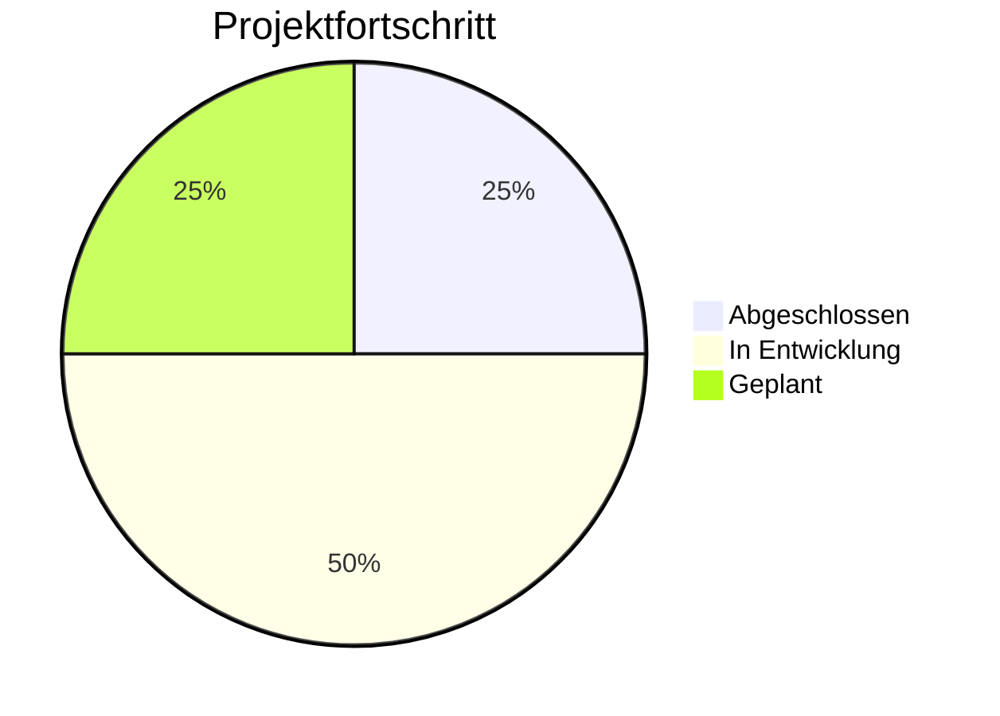
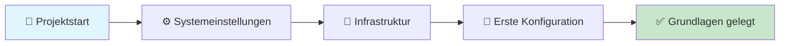
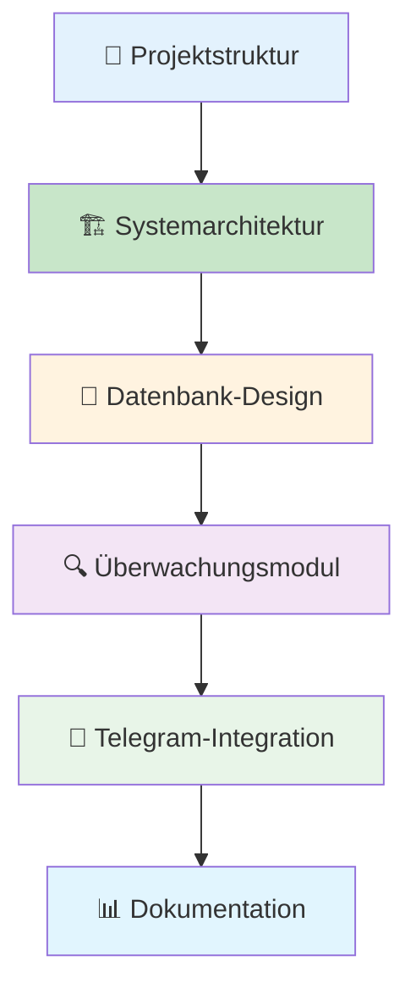
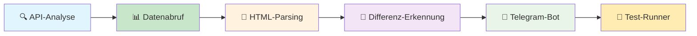
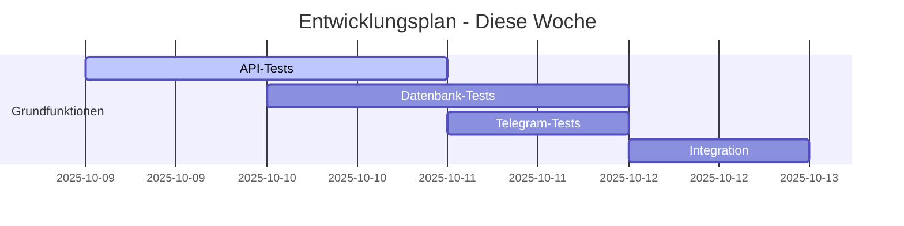
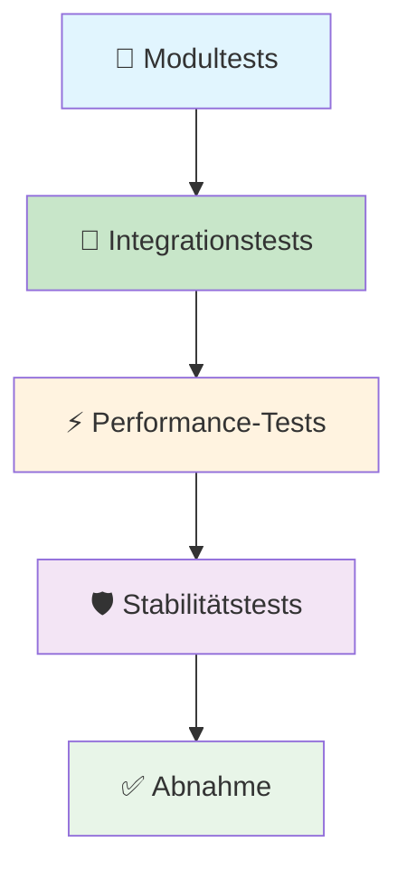

# Auto-Alert-Pi - Ihr Projektfortschritt

> *"Falsche Lippen sind dem HERRN ein Gräuel; die aber treu handeln, gefallen ihm." (Sprüche 12,22)*

## 📈 Aktueller Projektstand

### 🎯 Gesamtfortschritt

### 📊 Meilensteine im Überblick

| **Phase** | **Status** | **Fortschritt** | **Nächster Schritt** |
|-----------|------------|-----------------|---------------------|
| **🏗️ Grundlagen** | ✅ Abgeschlossen | 100% | - |
| **🔧 Implementierung** | 🔄 In Entwicklung | 60% | Tests durchführen |
| **⚡ Optimierung** | ⏳ Geplant | 0% | Warten auf Phase 2 |
| **📋 Abnahme** | ⏳ Geplant | 0% | Warten auf Phase 3 |

---

## 📅 Detaillierter Fortschrittsverlauf

### 🎉 06.10.2025 - Projekt erfolgreich gestartet
**Status:** ✅ Abgeschlossen  
**Entwicklungszeit:** 2h 30min (23:00-01:30)  
**Entwickler:** Andreas Eirich

#### Was wurde in der ersten Nacht gemacht:

| **Aufgabe** | **Status** | **Ergebnis** |
|-------------|------------|--------------|
| Erste Systemeinstellungen | ✅ Fertig | Grundkonfiguration erstellt |
| Grundlegende Infrastruktur | ✅ Fertig | Verzeichnisstruktur angelegt |
| Erste Konfigurationen | ✅ Fertig | Basis-Einstellungen vorgenommen |

#### Was bedeutet das für Sie:
- ✅ **Professioneller Start** - Das Projekt wurde systematisch begonnen
- ✅ **Transparente Dokumentation** - Alle Schritte sind nachvollziehbar
- ✅ **Nachverfolgbar** - Sie können jederzeit den Fortschritt sehen
- ✅ **Systematische Entwicklung** - Alles läuft nach Plan

---

### 🔧 07.10.2025 - Systemarchitektur erstellt
**Status:** ✅ Abgeschlossen  
**Entwicklungszeit:** 0h 49min (00:24-01:13)  
**Entwickler:** Andreas Eirich

#### Was wurde heute gemacht:

| **Komponente** | **Status** | **Beschreibung** |
|----------------|------------|------------------|
| **Projektstruktur** | ✅ Fertig | 3 Repositories professionell organisiert |
| **Systemarchitektur** | ✅ Fertig | Gesamtplan erstellt und dokumentiert |
| **Datenbank-Design** | 🔄 Grundstruktur | Schema vorbereitet, Tests stehen noch aus |
| **Überwachungsmodul** | 🔄 Grundstruktur | Logik angelegt, Validierung folgt |
| **Telegram-Integration** | 🔄 Grundstruktur | Codebasis steht, Funktionstests ausstehend |
| **Hauptanwendung** | 🔄 Grundstruktur | Erster Entwurf erstellt, noch ungetestet |

#### Was bedeutet das für Sie:
- ✅ **Professionelle Struktur** - Das System hat eine solide Grundlage
- 🔄 **Grundfunktionen vorbereitet** - Alle wichtigen Module sind angelegt
- ⏳ **Tests folgen** - Jede Funktion wird gründlich getestet
- ✅ **Transparente Kosten** - Ehrliche und klare Kostenstruktur
- ✅ **Realistische Planung** - Keine unrealistischen Versprechen

#### Nächste Schritte:
- 🔍 Willhaben-API analysieren
- 🧪 Erste Testmodule entwickeln
- 📱 Telegram-Integration implementieren
- ⚡ System schrittweise testen

---

### 📊 07.10.2025 - Testmodule entwickelt
**Status:** 🔄 In Entwicklung  
**Entwicklungszeit:** 1h 11min (13:49-15:00)  
**Entwickler:** Andreas Eirich

#### Was wurde heute gemacht:

| **Testmodul** | **Status** | **Zweck** |
|---------------|------------|-----------|
| **API-Analyzer** | 🔄 Grundstruktur | Analysiert willhaben.at Struktur |
| **Datenabruf** | 🔄 Grundstruktur | Lädt Inserate herunter |
| **HTML-Parser** | 🔄 Grundstruktur | Extrahiert Inserat-Details |
| **Differenz-Erkennung** | 🔄 Grundstruktur | Erkennt neue Inserate |
| **Telegram-Bot** | 🔄 Grundstruktur | Sendet Benachrichtigungen |
| **Test-Runner** | 🔄 Grundstruktur | Führt alle Tests aus |

#### Was bedeutet das für Sie:
- 🔄 **Testmodule erstellt** - Alle Systemkomponenten sind vorbereitet
- ⏳ **Validierung folgt** - Jedes Modul wird gründlich getestet
- ✅ **Transparenz** - Alle Module sind klar dokumentiert
- 🔄 **Nächste Phase** - Tests und Integration stehen an

#### Nächste Schritte:
- 🧪 Testmodule ausführen
- 🔍 Willhaben-API tatsächlich analysieren
- 💾 Datenbank-Schema validieren
- 📱 Telegram-Bot-Formatierung testen

---

## 🎯 Realistische Zeitplanung

### 📅 Diese Woche (09.-12.10.2025)
**Ziel:** Grundfunktionalität und erste Benachrichtigungen

### 📅 Nächste Woche (13.-15.10.2025)
**Ziel:** Optimierung und 24h-Stabilitätstest

| **Tag** | **Aufgabe** | **Ihr Nutzen** |
|---------|-------------|----------------|
| **13.10.** | Performance-Optimierung | System wird schneller |
| **14.10.** | 24h-Stabilitätstest | System läuft zuverlässig |
| **15.10.** | Fehlerbehandlung | System ist robust |

### 📅 Projektabschluss (16.-19.10.2025)
**Ziel:** Dokumentation und Übergabe

| **Tag** | **Aufgabe** | **Ihr Nutzen** |
|---------|-------------|----------------|
| **16.10.** | Vollständige Dokumentation | Sie verstehen alles |
| **17.10.** | Bedienungsanleitung | Sie können es bedienen |
| **18.10.** | Systemübergabe | Sie haben Ihr System |
| **19.10.** | Abschlussbericht | Vollständige Übersicht |

---

## 📊 Qualitätssicherung

### 🧪 Testphasen

### 📋 Qualitätskriterien

| **Kriterium** | **Ziel** | **Aktueller Stand** |
|---------------|----------|---------------------|
| **Funktionalität** | 100% | In Entwicklung |
| **Geschwindigkeit** | ≤ 4 Sekunden | In Entwicklung |
| **Stabilität** | 24h ohne Unterbrechung | In Entwicklung |
| **Dokumentation** | Vollständig | In Entwicklung |

---

## 💬 Kommunikation & Updates

### 📞 Regelmäßige Updates

- **Täglich** - Fortschrittsmeldungen
- **Transparent** - Ehrliche Zeiterfassung
- **Verzögerungen** - Klare Kommunikation
- **Dokumentation** - Alle Schritte protokolliert

### 🆘 Bei Fragen

- **Jederzeit erreichbar** - Für Rückfragen
- **Transparente Darstellung** - Des Fortschritts
- **Ehrliche Einschätzung** - Von Problemen
- **Professionelle Lösungen** - Für alle Herausforderungen

---

## 🎯 Ihr nächster Meilenstein

### ⏰ Wann Sie das nächste Update erhalten

**Nächste Meldung:** Nach erfolgreicher Ausführung der Testmodule  
**Erwarteter Zeitpunkt:** Diese Woche (09.-12.10.2025)  
**Inhalt:** Erste echte API-Tests und Validierungsergebnisse

### 📱 Was Sie erwarten können

- ✅ **Erste echte Tests** - System wird mit echten Daten getestet
- ✅ **Konkrete Ergebnisse** - Messbare Fortschritte
- ✅ **Nächste Schritte** - Klare Planung für die weitere Entwicklung
- ✅ **Zeitrahmen** - Realistische Einschätzung des Projektendes

---

**Letzte Aktualisierung:** 2025-10-07 16:00:18 (Europe/Berlin)  
**Entwickler:** Andreas Eirich  
**Status:** Testmodule werden validiert - Nächste Phase: Echte API-Tests