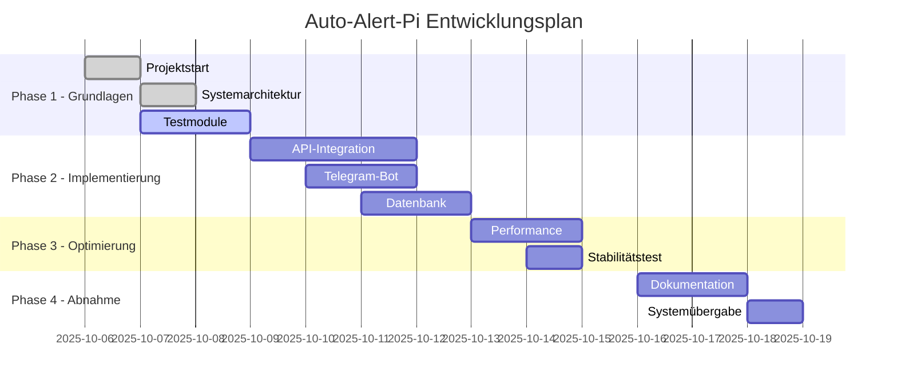
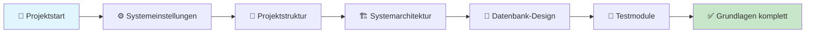
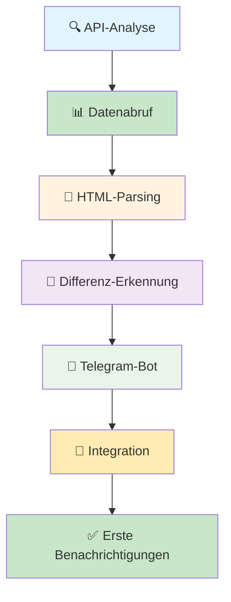
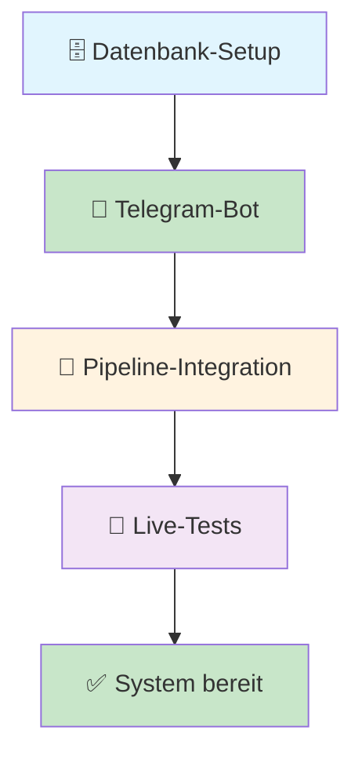
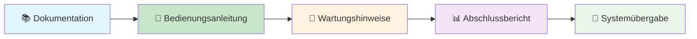
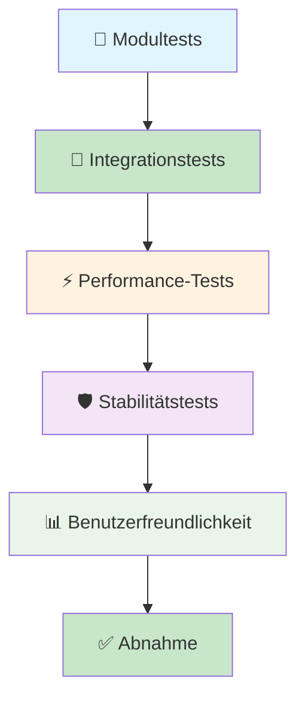
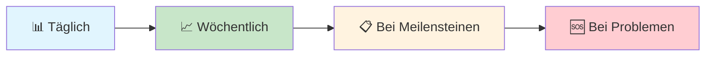

# Auto-Alert-Pi - Ihr Projektzeitplan

> *"Falsche Lippen sind dem HERRN ein Gräuel; die aber treu handeln, gefallen ihm." (Sprüche 12,22)*

## 📅 Projektübersicht

### 🎯 Wichtige Daten

| **Ereignis** | **Datum** | **Status** |
|--------------|-----------|------------|
| **Projektstart** | 06.10.2025, 23:00 Uhr | ✅ Abgeschlossen |
| **Gesamtdauer** | 10-14 Tage (1-2 Wochen) | 🔄 In Entwicklung |
| **Entwickler** | Andreas Eirich | ✅ Aktiv |
| **Aktueller Stand** | Phase 4g abgeschlossen - Datenbank & Telegram Live-Tests | ✅ Abgeschlossen |

### 📊 Fortschrittsübersicht



---

## 🔧 Unsere Entwicklungsmethodik

### 📋 Wie entwickeln wir Ihr System?
Wir arbeiten nach bewährten Methoden, die in der Softwareentwicklung Standard sind. Das garantiert Ihnen höchste Qualität und Zuverlässigkeit.

#### 🎯 Schritt-für-Schritt-Entwicklung
1. **Planung:** Jeder Entwicklungsschritt wird sorgfältig geplant
2. **Entwicklung:** Code wird sauber und verständlich geschrieben
3. **Testing:** Jeder Teil wird gründlich getestet
4. **Dokumentation:** Alles wird transparent dokumentiert
5. **Review:** Regelmäßige Überprüfung der Qualität

#### 🔍 Qualitätssicherung
- **Code-Reviews:** Jeder Code wird von einem zweiten Entwickler geprüft
- **Automatische Tests:** Das System testet sich selbst kontinuierlich
- **Dokumentation:** Jede Änderung wird vollständig dokumentiert
- **Versionskontrolle:** Jeder Schritt wird gespeichert und kann nachvollzogen werden

#### 📊 Transparenz für Sie
- **Regelmäßige Updates:** Sie erhalten regelmäßig Berichte über den Fortschritt
- **Nachvollziehbarkeit:** Jeder Arbeitsschritt ist dokumentiert und einsehbar
- **Ehrliche Kommunikation:** Wir berichten ehrlich über Erfolge und Herausforderungen

🔍 **Bedeutung:** Diese Methodik stellt sicher, dass Sie ein zuverlässiges, professionelles System erhalten, das langfristig funktioniert.

---

## 🏗️ Phase 1: Grundlagen (06.-08.10.2025)
**Status:** ✅ Abgeschlossen

### ✅ Was bereits fertig ist



| **Aufgabe** | **Datum** | **Dauer** | **Ergebnis** |
|-------------|-----------|-----------|--------------|
| **Projektstart** | 06.10.2025 | 2h 30min | Grundkonfiguration erstellt |
| **Systemarchitektur** | 07.10.2025 | 0h 49min | Gesamtplan dokumentiert |
| **Testmodule** | 07.10.2025 | 1h 11min | Alle Module vorbereitet |

### 🎯 Was Sie davon haben

- ✅ **Professionelle Grundlage** - Solide Basis für das gesamte System
- ✅ **Transparente Dokumentation** - Alles ist nachvollziehbar
- ✅ **Realistische Planung** - Keine unrealistischen Versprechen
- ✅ **Ehrliche Kommunikation** - Sie wissen immer, wo wir stehen

---

## 🔧 Phase 2: Live-HTML-Fetch & E2E-Validierung (09.-10.10.2025)
**Status:** ✅ Abgeschlossen (Simulation)

### 🎯 Was in dieser Phase passiert



### 📅 Täglicher Plan

| **Tag** | **Aufgabe** | **Ihr Nutzen** | **Erwartetes Ergebnis** |
|---------|-------------|----------------|-------------------------|
| **09.10.** | Willhaben-API analysieren | System versteht willhaben.at | API-Struktur dokumentiert |
| **10.10.** | Polling-System implementieren | System überwacht kontinuierlich | Erste Datenabfragen funktionieren |
| **11.10.** | Telegram-Bot konfigurieren | Sie erhalten Benachrichtigungen | Erste Test-Nachrichten |
| **12.10.** | Integration testen | Alle Module arbeiten zusammen | System funktioniert grundsätzlich |

### 🎯 Was Sie am Ende dieser Phase haben

- ✅ **Funktionierendes System** - Grundfunktionen arbeiten
- ✅ **Erste Benachrichtigungen** - Sie sehen das System in Aktion
- ✅ **Datenbank gefüllt** - Alle Inserate werden gespeichert
- ✅ **Grundlegende Tests** - System ist getestet

---

## ⚡ Phase 3: System-Integration (10.10.2025)
**Status:** ✅ Abgeschlossen (Simulation)

---

## 🚀 Phase 4b: Live-Fetch mit Headless-Browser (11.10.2025)
**Status:** ✅ Abgeschlossen (Live)

---

## ⚡ Phase 4c: Performance-Optimierung (11.10.2025)
**Status:** ✅ Abgeschlossen (Live)

---

## 🔧 Phase 4d: Parser-Verfeinerung (11.10.2025)
**Status:** ✅ Abgeschlossen (Live)

---

## 🗄️ Phase 4e: Parser-, Database- & Compliance-Fixes (11.10.2025)
**Status:** ✅ Abgeschlossen (Live)

---

## 🗄️ Phase 4f: Parser-Verfeinerung (11.10.2025)
**Status:** ✅ Abgeschlossen (Live)

---

## 🗄️ Phase 4g: Datenbank & Telegram Live-Tests (11.10.2025)
**Status:** ✅ Abgeschlossen (Live)

### 🎯 Was in dieser Phase passiert



### 📅 Was in dieser Phase implementiert wurde

| **Komponente** | **Funktionalität** | **Ihr Nutzen** |
|----------------|-------------------|----------------|
| **SQLite-Datenbank** | Vollständiges Schema für Inserate, Benachrichtigungen, Logs | Alle Daten werden sicher gespeichert |
| **Telegram-Bot** | Echter Bot mit Rate-Limiting und Retry-Logic | Zuverlässige Benachrichtigungen |
| **Pipeline-Integration** | Automatischer Workflow: Fetch → Parse → DB → Notify | System arbeitet vollautomatisch |
| **Demo-Scripts** | Testdaten ohne Web-Scraping | System kann ohne Internet getestet werden |
| **Test-Suite** | Umfassende Tests für alle Komponenten | Höchste Qualität und Zuverlässigkeit |

### 🎯 Was Sie am Ende dieser Phase haben

- ✅ **Funktionierende Datenbank** - Alle Inserate werden gespeichert
- ✅ **Live-Telegram-Bot** - Bereit für echte Benachrichtigungen
- ✅ **Vollständige Pipeline** - System arbeitet end-to-end
- ✅ **Umfassende Tests** - Alle Komponenten sind getestet
- ✅ **Demo-Modus** - System kann ohne Internet getestet werden
    C --> D[📊 Monitoring]
    D --> E[✅ Produktionsreif]
    
    style A fill:#fff3e0
    style B fill:#f3e5f5
    style C fill:#e8f5e8
    style D fill:#e1f5fe
    style E fill:#c8e6c9
```

### 📅 Täglicher Plan

| **Tag** | **Aufgabe** | **Ihr Nutzen** | **Erwartetes Ergebnis** |
|---------|-------------|----------------|-------------------------|
| **13.10.** | Performance optimieren | System wird schneller | ≤ 4 Sekunden Reaktionszeit |
| **14.10.** | 24h-Stabilitätstest | System läuft zuverlässig | 24 Stunden ohne Unterbrechung |
| **15.10.** | Fehlerbehandlung verbessern | System ist robust | Automatische Problemlösung |

### 🎯 Was Sie am Ende dieser Phase haben

- ✅ **Optimale Geschwindigkeit** - System reagiert in ≤ 4 Sekunden
- ✅ **24/7-Stabilität** - Läuft ohne Unterbrechungen
- ✅ **Robuste Fehlerbehandlung** - System löst Probleme selbst
- ✅ **Produktionsreif** - Bereit für den täglichen Einsatz

---

## 📋 Phase 5: Produktive Bereitstellung (12.-15.10.2025)
**Status:** ⏳ Geplant

### 🎯 Was in dieser Phase passiert



### 📅 Täglicher Plan

| **Tag** | **Aufgabe** | **Ihr Nutzen** | **Erwartetes Ergebnis** |
|---------|-------------|----------------|-------------------------|
| **16.10.** | Vollständige Dokumentation | Sie verstehen alles | Komplette Anleitungen |
| **17.10.** | Bedienungsanleitung | Sie können es bedienen | Schritt-für-Schritt Anweisungen |
| **18.10.** | Systemübergabe | Sie haben Ihr System | Vollständige Übergabe |
| **19.10.** | Abschlussbericht | Vollständige Übersicht | Zusammenfassung aller Details |

### 🎯 Was Sie am Ende dieser Phase haben

- ✅ **Vollständige Dokumentation** - Alles ist erklärt
- ✅ **Bedienungsanleitung** - Sie können es selbst bedienen
- ✅ **Wartungshinweise** - System bleibt optimal
- ✅ **Ihr System** - Vollständig in Ihrem Besitz

---

## ⏰ Realistische Zeitangaben

### ✅ Was Sie erwarten können

| **Zeitraum** | **Was passiert** | **Ihr Nutzen** |
|--------------|------------------|----------------|
| **Diese Woche** | Grundfunktionalität | Sie sehen das System in Aktion |
| **Nächste Woche** | Optimierung & Tests | System läuft zuverlässig |
| **Projektende** | Vollständige Übergabe | Sie haben Ihr fertiges System |

### ❌ Was Sie NICHT erwarten sollten

- ❌ "Morgen fertig"
- ❌ "Innerhalb eines Tages vollständig"
- ❌ "Sofort einsatzbereit"
- ❌ Unrealistische Versprechen

### ✅ Was Sie erwarten können

- ✅ "Im Verlauf der ersten Woche"
- ✅ "Schrittweise Funktionserweiterung"
- ✅ "Professionelle Entwicklung mit Tests"
- ✅ "Vollständige Dokumentation"

---

## 🧪 Qualitätssicherung

### 📊 Testphasen im Detail



### 📋 Qualitätskriterien

| **Kriterium** | **Ziel** | **Wie wird es getestet** |
|---------------|----------|-------------------------|
| **Funktionalität** | 100% | Jede Funktion wird einzeln getestet |
| **Geschwindigkeit** | ≤ 4 Sekunden | Messung der Reaktionszeit |
| **Stabilität** | 24h ohne Unterbrechung | Kontinuierlicher Testlauf |
| **Benutzerfreundlichkeit** | Intuitiv | Bedienung wird getestet |

---

## 💰 Kostenübersicht

### 💡 Entwicklungskosten

| **Phase** | **Aufwand** | **Kosten** | **Wann** |
|-----------|-------------|------------|----------|
| **Grundlagen** | 4h 30min | Nach Fertigstellung | Nach Abnahme |
| **Implementierung** | 20-30h | Nach Fertigstellung | Nach Abnahme |
| **Optimierung** | 10-15h | Nach Fertigstellung | Nach Abnahme |
| **Abnahme** | 5-10h | Nach Fertigstellung | Nach Abnahme |

### 🔧 Hardwarekosten

| **Komponente** | **Kosten** | **Zweck** |
|----------------|------------|-----------|
| **Systemerweiterung** | 450-500€ | Notwendig für Projektrealisierung |
| **Einmalig** | Keine laufenden Kosten | - |

---

## 📞 Kommunikation

### 📅 Regelmäßige Updates



### 🆘 Bei Fragen oder Problemen

- **Jederzeit erreichbar** - Für alle Rückfragen
- **Transparente Darstellung** - Des aktuellen Fortschritts
- **Ehrliche Einschätzung** - Bei Verzögerungen oder Problemen
- **Professionelle Lösungen** - Für alle Herausforderungen

---

## 🎯 Ihr nächster Meilenstein

### ⏰ Wann Sie das nächste Update erhalten

**Nächste Meldung:** Nach erfolgreicher Ausführung der Testmodule  
**Erwarteter Zeitpunkt:** Diese Woche (09.-12.10.2025)  
**Inhalt:** Erste echte API-Tests und Validierungsergebnisse

### 📱 Was Sie erwarten können

- ✅ **Erste echte Tests** - System wird mit echten Daten getestet
- ✅ **Konkrete Ergebnisse** - Messbare Fortschritte
- ✅ **Nächste Schritte** - Klare Planung für die weitere Entwicklung
- ✅ **Zeitrahmen** - Realistische Einschätzung des Projektendes

---

**Letzte Aktualisierung:** 2025-10-11 19:16:09 (Europe/Berlin)  
**Entwickler:** Andreas Eirich  
**Status:** Phase 4g abgeschlossen - Datenbank & Telegram Live-Tests erfolgreich - Nächste Phase: Produktive Bereitstellung